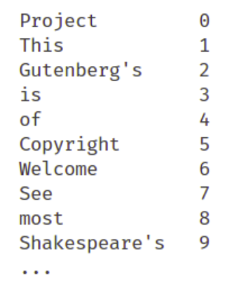
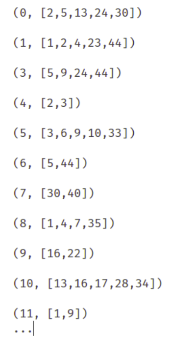
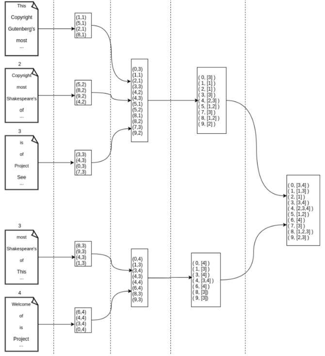

# inverted-index-search

## Introduction

## Motivation
One way to represent documents is vector representation. Inverted indexing speeds up distance and similarity calculations between documents. 

# Approach
Create a dictionary for all words for all documents. Each word has it's own id. 

 

 

 

